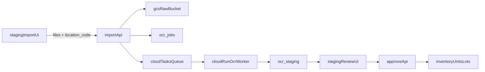

# OCR本番化 再設計ドキュメント（レビューワー確認用）

更新日: 2026-04-08  
対象: Webアップロード起点の OCR 一括取り込み～確認～在庫反映

## 1. 背景

従来は `staging` へ候補を置く導線が複数（Drive Inbox / デモ / 手動）あり、以下の課題がありました。

- `import` API が OCR 実行に未接続（staging 仮登録のみ）
- `DATABASE_URL` 優先分岐で認証を迂回可能
- 画像を `data:` URL でDB格納しており、性能・運用面で不利
- 保管場所コードが在庫テーブルの `storage_location_id` に正規反映されない

本ドキュメントは、上記を是正する本番運用向け再設計の全体像をまとめます。

## 2. 目的

- Web 一括アップロードから OCR 完了までを一気通貫化
- 認証・認可を必須化し、監査可能な更新に統一
- 保管場所を在庫へ正規反映
- 重複候補を人手で解決できる UI を維持

## 3. 目標アーキテクチャ

## 4. データモデル

### 4.1 `ocr_staging`（拡張）

主な追加/利用列:

- `batch_id`
- `source` (`PIPELINE` / `WEB_UPLOAD`)
- `input_location_code`
- `duplicate_status` (`NONE` / `CANDIDATE` / `RESOLVED`)
- `duplicate_card_id`
- `merge_decision` (`MERGE_EXISTING` / `CREATE_NEW`)
- `ocr_job_id` (FK -> `ocr_jobs`)
- `ocr_status` (`PENDING` / `RUNNING` / `SUCCEEDED` / `FAILED`)
- `resolved_storage_location_id` (FK -> `storage_locations`)

### 4.2 `ocr_jobs`（新設）

- `job_id` (PK)
- `batch_id`
- `gcs_bucket`, `gcs_object_path`
- `status` (`QUEUED` / `RUNNING` / `SUCCEEDED` / `FAILED` / `RETRY`)
- `attempt_count`, `next_run_at`, `last_error`
- `created_by`, `created_at`, `updated_at`

### 4.3 マイグレーション

- `db/migrations/000004_ocr_batch_and_duplicate_fields.*.sql`
- `db/migrations/000005_ocr_jobs_and_staging_finalize.*.sql`

## 5. API/処理責務

### 5.1 Web側

- `POST /api/staging/import`
  - 認証・権限確認（operator/admin）
  - ファイル検証（件数/サイズ/形式）
  - GCSへ保存
  - `ocr_jobs` + `ocr_staging`（OCR中プレースホルダ）作成
  - Cloud Tasks enqueue

- `POST /api/staging/[id]/approve`
  - 認証・権限確認
  - `merge_decision` に応じた在庫反映
  - `input_location_code` -> `storage_location_id` 解決
  - transaction で staging と在庫更新を一貫処理

- `POST /api/staging/[id]/reject`
  - 認証・権限確認
  - review status 更新

### 5.2 Worker側（Cloud Run）

- `POST /internal/ocr-job`
  - (任意) 共有シークレットヘッダ検証
  - `ocr_jobs` -> RUNNING
  - GCS画像取得
  - Gemini OCR実行
  - 重複候補判定（`serial_number` 優先 + `set_code/card_number_text`）
  - `ocr_staging` 更新、`ocr_jobs` 完了/失敗更新

## 6. UI方針

- `staging/import`
  - 複数画像アップロード
  - `input_location_code` 必須

- `staging` 一覧
  - OCR状態（実行中/失敗/完了）
  - 重複候補バッジ
  - 保管場所コード表示

- `staging/[id]` 詳細
  - OCR未完了時は確定操作を抑止
  - 重複候補時に `MERGE_EXISTING` / `CREATE_NEW` 選択
  - 保管場所コードの個別上書き

## 7. セキュリティ/権限

- `import/approve/reject` は認証必須
- `app_users.role in ('operator', 'admin')` のみ操作許可
- `reviewer_id` は固定値禁止（実ユーザーID）
- Worker内部APIは以下を推奨:
  - Cloud Tasks OIDC（サービスアカウント）
  - 追加で `X-OCR-Secret`（共有シークレット）

## 8. 環境変数

Web側:

- `DATABASE_URL`
- `GOOGLE_CLOUD_PROJECT`
- `GCS_BUCKET`
- `CLOUD_TASKS_LOCATION`
- `CLOUD_TASKS_QUEUE`
- `WORKER_URL`
- `CLOUD_TASKS_SERVICE_ACCOUNT_EMAIL`（OIDC利用時）
- `OCR_WORKER_SHARED_SECRET`（任意推奨）

Worker側:

- `DATABASE_URL`
- `GEMINI_API_KEY`
- `OCR_WORKER_SHARED_SECRET`（任意推奨）
- 既存 Drive/Sheets 併用時は既存設定

## 9. 受け入れ条件（レビュー観点）

- Webアップロード後に Cloud Tasks 経由で OCR が実行される
- API は未認証で `401`、権限不足で `403`
- 画像本体は DB ではなく GCS に保存される
- approve 後、`storage_location_id` が在庫に反映される
- 重複候補の可視化・統合/新規選択が機能する
- transaction 失敗時に staging / 在庫更新が部分適用されない

## 10. 既知のリスク

- Cloud設定不備（Queue/SA/URL）でジョブ未実行
- OCR遅延（大量バッチ時）
- 重複判定の誤検知/見逃し（判定ロジックの継続改善が必要）

## 11. 今後の改善候補

- `ocr_jobs` 失敗時の再実行UI（手動再キュー）
- OCR結果と最終承認値の差分ログ
- 重複候補スコアリング（name類似度を導入）
- worker の Drive経由処理と Web経由処理の責務分離

